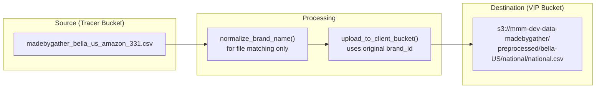

# Brand ID Exception - S3 Path Implementation Plan

Fix the S3 destination path to preserve original brand_id format (`bella-US`) instead of normalized format (`bella_us`).

---

## Problem Statement

**Current Behavior:**
```
brand_id: "bella-US"  →  normalize_brand_name()  →  "bella_us"
S3 Path: s3://mmm-dev-data-madebygather/preprocessed/bella_us/national/national.csv  ❌
```

**Expected Behavior:**
```
brand_id: "bella-US"  
S3 Path: s3://mmm-dev-data-madebygather/preprocessed/bella-US/national/national.csv  ✓
```

---

## Root Cause Analysis

| Location | Line | Issue |
|----------|------|-------|
| [lambda_function.py](file:///c:/Users/Development/Desktop/Data_ingestion/local_repo/MikGorilla.AI/data_ingestion_pipeline/lambdas/mmm_dev_data_transfer/lambda_function.py#L1640) | 1640 | `normalize_brand_name(brand_name)` converts `bella-US` → `bella_us` |
| [lambda_function.py](file:///c:/Users/Development/Desktop/Data_ingestion/local_repo/MikGorilla.AI/data_ingestion_pipeline/lambdas/mmm_dev_data_transfer/lambda_function.py#L1649) | 1649 | `config.get_destination_path(normalized_brand, retailer_id)` uses normalized value |

**Why normalization exists:**
- Tracer bucket files use `_` format: `madebygather_bella_us_amazon_331.csv`
- DynamoDB keys use `-` format: `bella-US#amazon`
- Normalization was intended for **file matching**, not for **destination paths**

---

## Proposed Solution

### Option A: Use brand_id directly for S3 paths (Recommended)

Modify `upload_to_client_bucket()` to use the original `brand_name` parameter (which is actually `brand_id` from the event) for S3 destination paths.

```python
# Before (line 1640)
normalized_brand = normalize_brand_name(brand_name)

# After - Use original brand_name for S3 path
# brand_name parameter contains original brand_id from event/DynamoDB (e.g., 'bella-US')
s3_brand_path = brand_name  # Preserve original format for S3
```

---

## Proposed Changes

### [MODIFY] [lambda_function.py](file:///c:/Users/Development/Desktop/Data_ingestion/local_repo/MikGorilla.AI/data_ingestion_pipeline/lambdas/mmm_dev_data_transfer/lambda_function.py)

#### Change 1: Modify `upload_to_client_bucket()` (lines 1639-1654)

```diff
def upload_to_client_bucket(
    file_data: bytes,
    source_key: str,
    client_id: str,
    brand_name: str,
    retailer_id: str,
    destination_bucket: Optional[str] = None
) -> str:
    """
    Upload processed file to VIP client bucket.
-   New structure: preprocessed/{normalized_brand_name}/{retailer_id}/{retailer_id}.csv
+   New structure: preprocessed/{brand_name}/{retailer_id}/{retailer_id}.csv
    
-   Uses normalized brand_name for consistency with DynamoDB keys and Tracer bucket conventions.
+   Uses original brand_name (brand_id) to match DynamoDB schema and S3 path expectations.
+   Note: brand_name parameter contains original brand_id (e.g., 'bella-US'), not normalized.
    
    ...
    """
-   # Normalize brand_name for S3 path consistency
-   normalized_brand = normalize_brand_name(brand_name)
+   # Use original brand_name for S3 path (preserves 'bella-US' format from DynamoDB)
+   # Do NOT normalize - destination paths must match brand_id exactly
+   s3_brand_path = brand_name
    
    # Compute VIP bucket name dynamically with override support
    vip_bucket = get_vip_bucket_name(client_id, override_bucket=destination_bucket)
    
    # New VIP bucket structure: preprocessed/brand_name/retailer_id/retailer_id.csv
    if CONFIG_AVAILABLE:
-       dest_key = config.get_destination_path(normalized_brand, retailer_id)
+       dest_key = config.get_destination_path(s3_brand_path, retailer_id)
    else:
-       dest_key = f"preprocessed/{normalized_brand}/{retailer_id}/{retailer_id}.csv"
+       dest_key = f"preprocessed/{s3_brand_path}/{retailer_id}/{retailer_id}.csv"
```

#### Change 2: Update logging to reflect actual path (lines 1660-1670)

```diff
-   logger.info(f"Uploaded to VIP bucket: s3://{vip_bucket}/{dest_key} (brand={normalized_brand})")
+   logger.info(f"Uploaded to VIP bucket: s3://{vip_bucket}/{dest_key} (brand={s3_brand_path})")
```

---

## Data Flow After Fix



---

## Verification Plan

### 1. Unit Test

```python
def test_upload_preserves_brand_id():
    """Verify S3 destination path preserves original brand_id format."""
    # Test case: bella-US should NOT be converted to bella_us
    brand_name = "bella-US"
    retailer_id = "national"
    
    expected_path = "preprocessed/bella-US/national/national.csv"
    
    # Call the function (mock S3 upload)
    actual_path = get_destination_path(brand_name, retailer_id)
    
    assert actual_path == expected_path, f"Expected {expected_path}, got {actual_path}"
```

### 2. Integration Test

After deployment:
```bash
# Check S3 path structure
aws s3 ls s3://mmm-dev-data-madebygather/preprocessed/bella-US/national/
# Expected: national.csv

# Verify old normalized path is NOT created
aws s3 ls s3://mmm-dev-data-madebygather/preprocessed/bella_us/
# Expected: No files (path should not exist)
```

---

## Impact Assessment

| Area | Impact | Risk |
|------|--------|------|
| S3 Paths | Paths will now use `bella-US` instead of `bella_us` | Low - matches DynamoDB format |
| File Matching | Unchanged - still uses normalized format for Tracer | None |
| Downstream | Model training expects `bella-US` paths | Positive - fixes current mismatch |
| Existing Data | Old files at `bella_us/` path may need migration | Medium - one-time cleanup |

---

## Rollback Plan

If issues arise:
1. Revert the change to `upload_to_client_bucket()`
2. Redeploy Lambda
3. Old normalized paths will be used again
